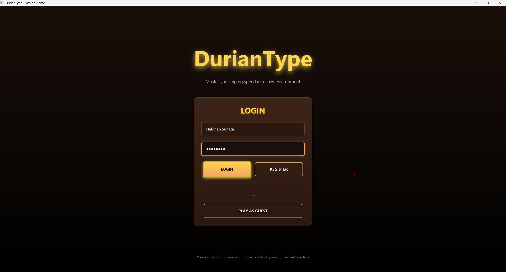
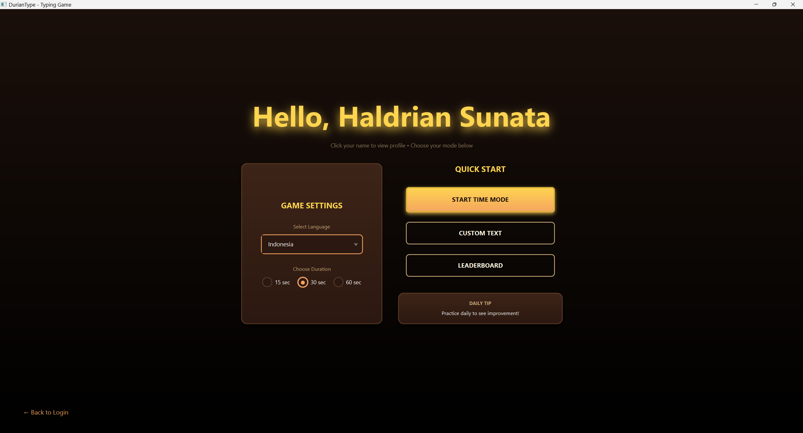
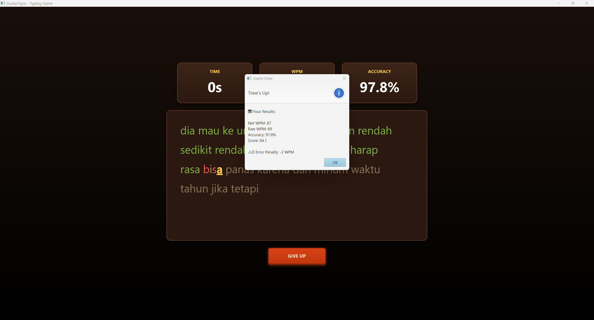
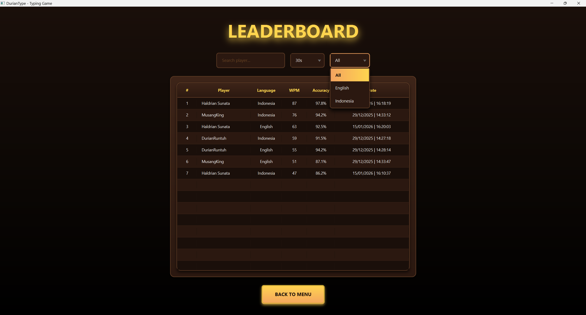
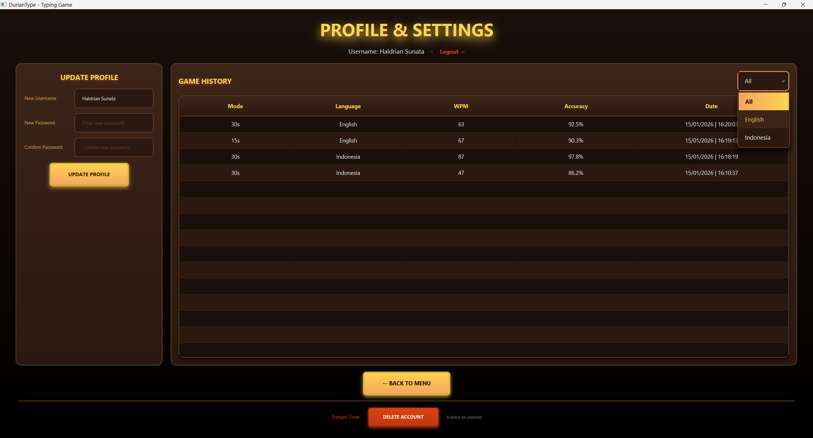
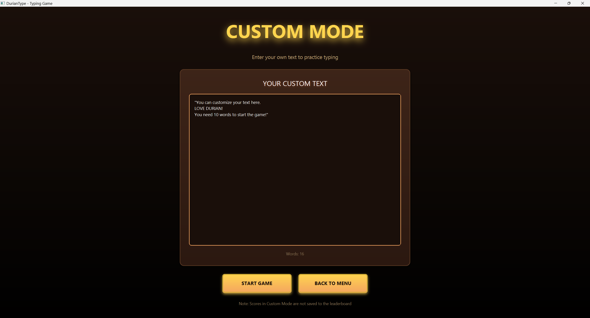
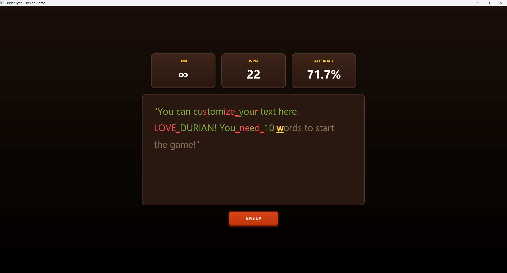

<p align="center">
  
  
  
  
</p>

<h1 align="center">
  
  <br>
  DurianType
</h1>

<p align="center">
  <strong>A Modern Typing Speed Test Application</strong><br>
  Built with JavaFX • Dark Durian-Inspired Theme • Professional Statistics
</p>

<p align="center">
  
</p>

---

## 📖 About

**DurianType** is a feature-rich typing speed test application created as a final project for the Object-Oriented Programming (OOP) course in my third semester. It measures your typing speed (WPM), accuracy, and provides a weighted scoring system for fair competition.

###  Why "DurianType"?

The name comes from my name **"Haldrian"** — the suffix **"drian"** sounds like **"durian"** (the iconic tropical fruit shown above). Combined with "Type" for a typing test app, **DurianType** was born! The app's dark theme with green and golden yellow accents is also inspired by the durian fruit's colors.

### ✨ Key Features

| Feature | Description |
|---------|-------------|
| 🎯 **Multiple Time Modes** | Choose between 15s, 30s, or 60s tests |
| 🌏 **Bilingual Support** | English and Indonesian word lists |
| ✏️ **Custom Mode** | Practice with your own text (sandbox) |
| 📊 **Real-time Statistics** | Live WPM, Accuracy, and Timer display |
| 🏆 **Leaderboard** | Compete globally with weighted scoring |
| 👤 **User Profiles** | Track personal history and progress |
| ⌫ **Backspace Support** | Correct mistakes (but errors still count!) |
| 🎨 **Dark Theme** | Eye-friendly durian-inspired color palette |

---

## 🖼️ User Interface Tour

### 🔑 Login & Main Menu
<table align="center">
  <tr>
    <td align="center" width="50%">
      
      <br>
      <b>Login / Register</b><br>
      Secure entry point. Features account creation for saving history and scores. Includes a <b>Guest Mode</b> for quick, instant access without registration.
    </td>
    <td align="center" width="50%">
      
      <br>
      <b>Main Menu</b><br>
      The application hub. Allows seamless selection of <b>Time Modes</b> (15s, 30s, 60s) and <b>Language</b> (English/Indonesia). Provides quick navigation to all other features.
    </td>
  </tr>
</table>

### ⚡ Typing Experience
<table align="center">
  <tr>
    <td align="center" width="50%">
      
      <br>
      <b>Typing Interface</b><br>
      Core gameplay area with real-time feedback. <br>
      • <b>Green/Red Highlighting</b>: Instant visual feedback.<br>
      • <b>Live Stats</b>: Tracks WPM and Accuracy as you type.<br>
      • <b>Infinite Scroll</b>: Words refresh automatically (Logic handled by <code>GameController</code> batching system).
    </td>
    <td align="center" width="50%">
      
      <br>
      <b>Results Summary</b><br>
      Comprehensive post-game statistics. Displays <b>Net WPM</b>, <b>Gross WPM</b>, and calculates a <b>Weighted Score</b> for the leaderboard.
    </td>
  </tr>
</table>

### 📊 Statistics & Competition
<table align="center">
  <tr>
    <td align="center" width="50%">
      
      <br>
      <b>Global Leaderboard</b><br>
      Competitive rankings powered by SQLite.<br>
      • <b>Filtering</b>: Sort by Time Mode and Language.<br>
      • <b>Search</b>: Find specific users by name.<br>
      • <b>Rankings</b>: Automatic sorting by Weighted Score.
    </td>
    <td align="center" width="50%">
      
      <br>
      <b>User Profile & Account Management</b><br>
      Complete user dashboard.<br>
      • <b>History Tracker</b>: View detailed history of all attempts.<br>
      • <b>Profile Update</b>: Change Username and Password.<br>
      • <b>History Filter</b>: Filter past games by Language (Eng/Ind).<br>
      • <b>Delete Account</b>: Permanent account deletion option with confirmation.
    </td>
  </tr>
</table>

### ✏️ Custom Mode (Sandbox)
<div align="center">
  
  
  <br>
  <b>Custom Text Practice</b><br>
  A dedicated sandbox mode. Paste your own text into the text area to practice specific paragraphs. 
  <br><i>Features infinite time (Timer shows ∞) and sequential text flow without shuffling.</i>
</div>

---

## 🏗️ Architecture

### Tech Stack
```
├── Frontend:     JavaFX 23 (FXML + CSS)
├── Backend:      Java 24
├── Database:     SQLite (JDBC)
└── Build:        Manual compilation (no Maven/Gradle)
```

### Project Structure
```
DurianType/
├── src/
│   ├── main/java/com/typingapp/
│   │   ├── MainApp.java              # Application entry point
│   │   ├── controller/               # UI Controllers (MVC)
│   │   │   ├── LoginController.java
│   │   │   ├── MenuController.java
│   │   │   ├── GameController.java
│   │   │   ├── ProfileController.java
│   │   │   ├── LeaderboardController.java
│   │   │   └── CustomController.java
│   │   ├── engine/                   # Game Logic (OOP Core)
│   │   │   ├── GameEngine.java       # Abstract parent class
│   │   │   ├── TimeGame.java         # Timed mode (saves score)
│   │   │   └── CustomGame.java       # Sandbox mode (no save)
│   │   ├── model/                    # Data Models
│   │   │   ├── User.java
│   │   │   └── Score.java
│   │   ├── database/                 # Database Layer
│   │   │   └── DatabaseHelper.java
│   │   └── util/                     # Utilities
│   │       ├── Constants.java
│   │       ├── AlertHelper.java
│   │       └── NavigationHelper.java
│   └── resources/
│       ├── fxml/                     # UI Layouts
│       ├── css/style.css             # Dark Durian Theme
│       └── data/                     # Word Lists
│           ├── words_en.txt
│           └── words_id.txt
├── lib/                              # Dependencies (JavaFX, SQLite)
└── bin/                              # Compiled classes
```

---

## 🧬 OOP Concepts Implemented

### 1. **Abstraction**
```java
public abstract class GameEngine {
    public abstract void endGame(User user, int time, String lang);
}
```
- `GameEngine` is abstract - cannot be instantiated directly
- Defines contract for child classes

### 2. **Inheritance**
```java
public class TimeGame extends GameEngine { ... }
public class CustomGame extends GameEngine { ... }
```
- Both inherit WPM, Accuracy calculation methods
- Reuse common game logic

### 3. **Polymorphism**
```java
// TimeGame saves to database
@Override
public void endGame(User user, int time, String lang) {
    DatabaseHelper.addScore(...);  // SAVES
}

// CustomGame does NOT save
@Override
public void endGame(User user, int time, String lang) {
    System.out.println("Custom mode - score not saved");  // NO SAVE
}
```
- Same method name, different behavior

### 4. **Encapsulation**
```java
public class User {
    private int id;           // Private fields
    private String username;
    
    public String getUsername() { return username; }  // Public getters
    public void setUsername(String name) { this.username = name; }
}
```
- Data hidden with `private`
- Accessed through getters/setters

---

## 📊 Scoring System

### WPM Calculation
```
Gross WPM = (Total Characters Typed / 5) / Minutes
Net WPM   = (Correct Characters / 5) / Minutes
```
> Industry standard: 5 characters = 1 word

### Accuracy Calculation (Keystroke-Based)
```
Accuracy = (Correct Keystrokes / Total Keystrokes) × 100
```
> **Note:** Backspace allows visual correction, but the original error **still counts** toward accuracy. This prevents gaming the system.

### Weighted Score (for Leaderboard)
```
Weighted Score = Net WPM × (Accuracy / 100) ^ 1.5
```
> Higher accuracy weight prevents "spammers" from ranking high

---

## 🚀 Getting Started

### Prerequisites

Before you begin, ensure you have the following installed:

| Requirement | Version | Download |
|-------------|---------|----------|
| **Java JDK** | 21+ (recommended: 24) | [Oracle JDK](https://www.oracle.com/java/technologies/downloads/) or [Adoptium](https://adoptium.net/) |
| **Git** | Any recent version | [git-scm.com](https://git-scm.com/downloads) |

Verify Java installation:
```bash
java --version
```

---

### Step 1: Clone the Repository

```bash
git clone https://github.com/haldriansunata/DurianType.git
cd DurianType
```

---

### Step 2: Setup Dependencies

> [!IMPORTANT]
> The `lib/` folder is **not included** in the repository due to file size limits. You must download the dependencies manually.

#### 2.1 Create the `lib/` folder

Create a folder named `lib` in the project root:
```
duriantype/
├── lib/           ← Create this folder
├── src/
├── .vscode/
└── README.md
```

#### 2.2 Download JavaFX SDK

1. Go to **[Gluon JavaFX Downloads](https://gluonhq.com/products/javafx/)**
2. Select:
   - Version: **25.0.1** (or latest LTS)
   - Type: **SDK**
   - Operating System: **Windows / macOS / Linux**
3. Download and extract the `.zip` file
4. Copy the extracted `javafx-sdk-25.0.1` folder into `lib/`

Result:
```
lib/
└── javafx-sdk-25.0.1/
    └── lib/
        ├── javafx.base.jar
        ├── javafx.controls.jar
        ├── javafx.fxml.jar
        └── ...
```

#### 2.3 Download SQLite JDBC

1. Go to **[SQLite JDBC Releases](https://github.com/xerial/sqlite-jdbc/releases)**
2. Download `sqlite-jdbc-3.49.1.0.jar` (or latest version)
3. Place the `.jar` file directly in `lib/`

Final `lib/` structure:
```
lib/
├── javafx-sdk-25.0.1/
│   └── lib/
│       └── (JavaFX jar files)
└── sqlite-jdbc-3.49.1.0.jar
```

> [!WARNING]
> The folder name must be exactly `javafx-sdk-25.0.1` to match the VS Code configuration. If you download a different version, update the path in `.vscode/launch.json`.

---

### Step 3: Setup VS Code (Recommended)

#### 3.1 Install Required Extensions

Install the **Extension Pack for Java** which includes:
- Language Support for Java
- Debugger for Java
- Project Manager for Java

Search for `vscjava.vscode-java-pack` in the Extensions marketplace or install via:
```
ext install vscjava.vscode-java-pack
```

#### 3.2 Open the Project

1. Open VS Code
2. Go to **File → Open Folder**
3. Select the `duriantype` folder
4. Wait for Java extension to index the project (check the status bar at the bottom)

#### 3.3 Run the Application

- Press **F5** or go to **Run → Start Debugging**
- Alternatively, click the green **▶ Play** button in the Run and Debug panel

> [!NOTE]
> The `.vscode/` folder contains pre-configured `settings.json` and `launch.json` files. VS Code will automatically detect these settings.

---

### Step 4: Setup for Other IDEs

<details>
<summary>IntelliJ IDEA</summary>

1. Open project folder
2. Go to **File → Project Structure → Libraries**
3. Add `lib/javafx-sdk-25.0.1/lib` as a library
4. Add `lib/sqlite-jdbc-3.49.1.0.jar` as a library
5. Edit Run Configuration → Add VM Options:
   ```
   --module-path "lib/javafx-sdk-25.0.1/lib" --add-modules javafx.controls,javafx.fxml
   ```
6. Set Main Class: `com.typingapp.MainApp`

</details>

<details>
<summary>Eclipse</summary>

1. Import project as existing Java project
2. Right-click project → **Build Path → Configure Build Path**
3. Add all JARs from `lib/javafx-sdk-25.0.1/lib/` and `lib/sqlite-jdbc-3.49.1.0.jar`
4. Create Run Configuration with VM arguments:
   ```
   --module-path "lib/javafx-sdk-25.0.1/lib" --add-modules javafx.controls,javafx.fxml
   ```

</details>

<details>
<summary>Command Line (Manual)</summary>

Compile:
```bash
javac --module-path "lib/javafx-sdk-25.0.1/lib" --add-modules javafx.controls,javafx.fxml -d bin -sourcepath src/main/java src/main/java/com/typingapp/*.java src/main/java/com/typingapp/**/*.java
```

Run:
```bash
java --module-path "lib/javafx-sdk-25.0.1/lib" --add-modules javafx.controls,javafx.fxml -cp "bin;lib/sqlite-jdbc-3.49.1.0.jar;src/resources" com.typingapp.MainApp
```

> **Note:** On Linux/Mac, replace `;` with `:` in the classpath.

</details>

---

## 🎮 How to Play

1. **Login** or play as **Guest**
2. Select **Language** (English/Indonesia)
3. Select **Time Mode** (15s / 30s / 60s)
4. Click **START TYPING**
5. Type the words as they appear
   - ✅ Green = Correct
   - ❌ Red = Wrong
   - ⌫ Backspace = Fix mistakes (accuracy still affected!)
6. Game ends when timer reaches 0
7. View your **WPM**, **Accuracy**, and **Weighted Score**

---

## 🎨 Color Palette

| Element | Color | Hex |
|---------|-------|-----|
| Background | Dark Brown | `#1A0F0A` → `#000000` |
| Card Surface | Brown | `#2B1810` |
| Border | Medium Brown | `#5C3A24` |
| Primary Text | White | `#FFFFFF` |
| Golden Accent | Yellow | `#FFD54F` |
| Correct | Green | `#7CB342` |
| Error | Red | `#D84315` |

---

## 📁 Database Schema

```sql
-- Users Table
CREATE TABLE users (
    id INTEGER PRIMARY KEY AUTOINCREMENT,
    username TEXT UNIQUE NOT NULL,
    password TEXT NOT NULL
);

-- Scores Table  
CREATE TABLE scores (
    id INTEGER PRIMARY KEY AUTOINCREMENT,
    user_id INTEGER,
    wpm INTEGER,
    gross_wpm INTEGER,
    accuracy REAL,
    weighted_score REAL,
    time_mode INTEGER,
    language TEXT,
    date TEXT,
    FOREIGN KEY (user_id) REFERENCES users(id) ON DELETE CASCADE
);
```


---

## 🛠️ Developer Guide

### 💾 CRUD Operations
The application implements standard CRUD operations via `DatabaseHelper.java`:
- **CREATE**: `addUser()` (Register), `addScore()` (End Game).
- **READ**: `loginUser()`, `getLeaderboard()`, `getHistory()`.
- **UPDATE**: `updateUser()` (Profile: change username/password).
- **DELETE**: `deleteUser()` (Available in Profile settings).

### 📝 Customizing Word Lists
Words are stored in flat text files inside `src/resources/data/`.
1. Open `src/resources/data/words_en.txt` (or `_id.txt`).
2. Add, remove, or edit words directly (space-separated or newlines).
3. **No rebuild required!** The app reads these files at runtime via `MenuController.loadWords()`.

### 🌍 Adding a New Language
To add support for a new language (e.g., "Spanish"):
1. **Create file**: Add `words_es.txt` in `src/resources/data/`.
2. **Update Constants**: Add `public static final String LANG_SPANISH = "Spanish";` in `Constants.java`.
3. **Update MenuController**:
   - Add language to ComboBox: `languageCombo.getItems().add(Constants.LANG_SPANISH);`
   - Update `handlePlayTimeMode()` to load the new file:
     ```java
     String filename = selectedLanguage.equals(Constants.LANG_SPANISH) ? "words_es.txt" : ...
     ```
4. **Update Profile & Leaderboard**: Ensure filters in `ProfileController` and `LeaderboardController` include the new language option.
<p align="center">
  
  
</p>

This project was developed with the assistance of **Google Gemini** and **Anthropic Claude** AI coding assistants for code generation, debugging, documentation, and UI improvements.

> All AI-generated code was reviewed and tested by the developer.

---

## 🤝 Contributing

Contributions are welcome! Feel free to:
- Report bugs
- Suggest features
- Submit pull requests

---

## 👨‍💻 Author

**Haldrian Sunata**  
Object-Oriented Programming Final Project  
2025

---

<p align="center">
  Made with ❤️ and ☕ | Inspired by <a href="https://monkeytype.com">Monkeytype</a>
</p>
